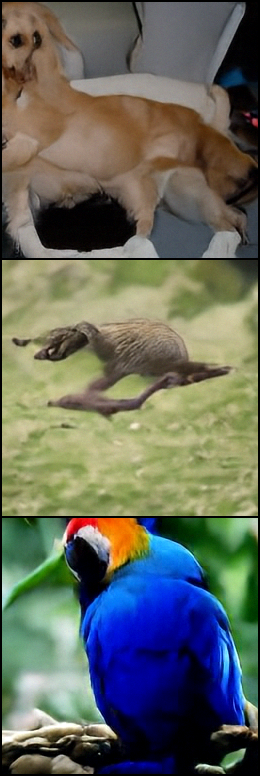

# diffusion_for_image_and_video

Image/video related diffusion models.

A from-scratch **Diffusion Transformer (DiT)** for class-conditional ImageNet
generation, trained in **pixel space** with a **flow-matching** objective.

The architecture follows [Scalable Diffusion Models with Transformers][dit]
(Peebles & Xie, 2023). The training and sampling formulation follows
[Back to Basics: Let Denoising Generative Models Denoise][jit]
(arXiv:2511.13720): a straight-line interpolant, x-prediction, an l2 loss in
v-space, and a Heun ODE solver.

[dit]: https://arxiv.org/abs/2212.09748
[jit]: https://arxiv.org/abs/2511.13720

## Why pixel space

Latent diffusion needs a VAE trained with adversarial and perceptual losses, so
generation is not driven purely by diffusion. Working directly on pixels
removes that dependency, but it raises the *observed dimension* problem: a
16x16x3 patch is 768-d, larger than many transformer widths, and at 512x512
with 32x32 patches it is 3072-d.

Two choices make that workable, both from the *Back to Basics* paper:

1. **x-prediction.** The network outputs a clean-image estimate directly. The
   paper reports that epsilon- and v-*prediction* fail catastrophically at high
   patch dimension (FID 372 and 96 vs 8.6 for x-prediction at 256x256, Tab. 2a).
   The loss may still be taken in v-space; only the *network output* must be x.
2. **A bottleneck patch embedding.** Counterintuitively, *reducing* dimension
   helps. See below.

## Install

```bash
python3 -m venv .venv
.venv/bin/pip install -r requirements.txt
```

## Train

```bash
# single GPU
python -m dit.train --data-repo ILSVRC/imagenet-1k --image-size 256 --amp

# 8 GPUs
torchrun --nproc_per_node=8 -m dit.train --global-batch-size 1024 --amp

# quick local check: stream a small dataset, no full download
python -m dit.train --data-repo uoft-cs/cifar10 --streaming \
    --image-size 32 --model DiT-S/16 --global-batch-size 32 --max-steps 100
```

`ILSVRC/imagenet-1k` is gated: accept the terms on the dataset page and run
`huggingface-cli login` (or set `HF_TOKEN`) once. Ungated pre-resized mirrors
such as `benjamin-paine/imagenet-1k-256x256` work too. `--streaming` avoids
downloading the full ~150 GB.

Logs report two numbers. `v-loss` is what is optimised; because it carries a
`1/(1-t)^2` weight it is noisy across batches. `x-mse` is the plain
reconstruction error and is the one to watch for progress.

At the end of a run the results directory also gets `loss_history.csv` and
`loss_curve.jpg`, a two-panel plot of both curves against training step with a
rolling-mean overlay. The history is stored in checkpoints, so `--resume`
continues the curve rather than restarting it. matplotlib is optional: without
it the CSV is still written and the plot is skipped.

## Sample

```bash
python -m dit.sample --ckpt results/ckpt_final.pt \
    --class-labels 207 360 88 979 --cfg-scale 2.0 \
    --num-steps 50 --solver heun --cfg-interval 0.1 1.0 --out samples.png
```

Sampling integrates `dz/dt = v(z,t)` from `t=0` (noise) to `t=1` (data) on a
linear grid. Heun costs `2N-1` network evaluations for `N` steps; `--solver
euler` costs `N` and is roughly first-order accurate. `noise_scale` and the
other process settings are read back from the checkpoint, so samples always
match how the model was trained.

## Results

An early checkpoint of a `DiT-B/16` run at 256x256, sampled with:

```bash
python -m dit.sample --ckpt ckpt_final.pt --class-labels 207 360 88 \
    --cfg-scale 2.0 --num-steps 50 --solver heun --out samples.png
```



Top to bottom: golden retriever (207), otter (360), macaw (88).

**What works.** All three are unambiguously the requested class, so label
embedding, adaLN-Zero conditioning, and classifier-free guidance are all doing
their job. Local statistics are convincing: fur, individual feathers, grass,
and background depth-of-field blur. Most importantly there is no catastrophic
failure, which is the outcome that matters most for a *pixel-space* model at
768-d patches -- the regime where the paper reports epsilon-prediction
collapsing to FID 372. x-prediction plus the bottleneck embedding holds up.

**What does not, yet.** Global structure. The retriever has a duplicated head
and an incoherent limb count; the otter's anatomy is scrambled. The macaw is
cleanest, which fits -- a rigid, high-contrast subject demands the least
long-range coherence, while a deformable body with no strong shape prior
demands the most.

That split, correct local texture with broken global geometry, is the expected
signature of an under-trained diffusion model rather than a defect: these
models acquire local statistics well before long-range structure. For scale,
the paper's ablations run 200 epochs and its headline numbers 600.

These are uncurated single samples at one guidance scale, not an evaluation.
There is no FID here, and one image per class cannot separate "the model has
this class right" from a lucky draw.

## Layout

| file | contents |
| --- | --- |
| `dit/model.py` | the DiT architecture: patch embedding, adaLN-Zero blocks, size configs |
| `dit/diffusion.py` | `FlowMatching`: interpolant, v-loss, Euler/Heun samplers |
| `dit/data.py` | ImageNet loading from the HuggingFace Hub, map-style or streaming |
| `dit/train.py` | training loop: EMA, AMP, DDP, checkpointing |
| `dit/sample.py` | load a checkpoint and write an image grid |
| `dit/plotting.py` | training-curve CSV and JPG |
| `tests/test_dit.py` | 74 tests |

## Model

`DiT-B/16` is the default: depth 12, hidden size 768, 12 heads, 16x16 patches,
~130M parameters, 256 tokens at 256x256. `DIT_MODELS` also registers the S, L
and XL sizes at several patch sizes.

Conditioning is **adaLN-Zero**: the timestep and class embeddings are summed
into a vector `c`, which produces a per-block shift, scale, and gate for both
sub-layers. The gates are zero-initialised, so every block starts as the
identity and the whole network starts by outputting zeros.

Classifier-free guidance uses an extra "null" row in the label embedding table.
During training labels are dropped with probability `--class-dropout-prob`
(0.1), so one network learns both the conditional and unconditional model.

### Bottleneck patch embedding

The patch embedding is a **low-rank** pair of linear layers with no
nonlinearity between them:

```
raw patch (768-d at 16x16x3)  ->  128  ->  768 (hidden)
```

This is the `bottleneck` row of Tab. 9 in the paper (128 for B/L, 256 for the
largest sizes) and is enabled by default; `--bottleneck-dim 0` restores the
original single-linear DiT embedding.

It is worth stating why this is surprising. The natural response to a 768-d
patch is to make the model *wider*. Instead, squeezing through 128 dimensions
*improves* FID by up to ~1.3, and even a 16-d bottleneck does not collapse
(Fig. 4). The interpretation is the manifold hypothesis: image patches have low
intrinsic dimension, and the bottleneck encourages the model to represent that
structure rather than all 768 directions.

It also decouples patch dimension from model width, which is what lets a
base-size model run at 512x512 (`DiT-B/32`, 3072-d patches) or 1024x1024
(`DiT-B/64`, 12288-d patches) with the same 768-d transformer and the same
sequence length.

## Formulation

Training (Alg. 1 of the paper):

```
t       ~ sigmoid(N(mu, sigma^2))       # logit-normal, mu = -0.8, sigma = 0.8
eps     ~ N(0, noise_scale^2 I)
z_t     = t * x + (1 - t) * eps
v       = (x - z_t) / (1 - t)
x_pred  = net(z_t, t)                   # x-prediction, no pre-conditioning
v_pred  = (x_pred - z_t) / (1 - t)
loss    = || v - v_pred ||^2
```

Notes on the details that matter:

- **`t = 0` is noise and `t = 1` is data**, the opposite of the DDPM index
  convention. `t` is continuous in `(0,1)`.
- **The logit-normal sampler concentrates training on high noise.** With
  `mu = -0.8` the median `t` is 0.31, so ~84% of samples fall below `t = 0.5`.
  Tab. 3 sweeps this: FID 14.44 at `mu = 0` vs 8.62 at `mu = -0.8`.
- **`1 - t` is clipped at 0.05** wherever it is used as a divisor.
- **The v-loss equals an x-loss weighted by `1/(1-t)^2`**, since both velocities
  share a denominator. The paper finds this weighting preferable but not
  critical, as long as the network itself predicts x.
- **`noise_scale` defaults to `image_size / 256`**, holding SNR roughly fixed
  across resolutions (2x at 512, 4x at 1024).
- **The timestep embedder takes `t` in `[0,1]` directly.** Its frequency ladder
  is defined over the unit interval (`max_freq` down to `max_freq/bandwidth`),
  so no caller has to rescale time on the way in.
- **The final ODE step always uses Euler**, even under `--solver heun`: at
  `t=1` the corrector would divide by the clipped denominator and inflate the
  velocity by up to 20x.

One deviation from the paper: the loss averages over elements where the paper
sums. The two differ by a constant factor that Adam largely absorbs.

## Tests

```bash
.venv/bin/python -m pytest tests/ -q
```

The suite checks properties rather than just shapes: that adaLN-Zero really
starts as the identity, that the bottleneck is genuinely rank-`d'` and strictly
linear, that classifier-free guidance matches its closed form, that the v-loss
equals the `1/(1-t)^2`-weighted x-loss, and that Heun converges at second order
while Euler converges at first. It also runs a real training step and drives
the sampling CLI end to end to a PNG.

## Not implemented

The paper's "just advanced" transformer components (SwiGLU, RMSNorm, RoPE,
qk-norm, in-context class tokens) are not here; the architecture is the
original DiT block. Those account for roughly 7.5 -> 5.5 FID in Tab. 4. There
is also no FID evaluation, no video support yet, and no dropout for the larger
model sizes.
